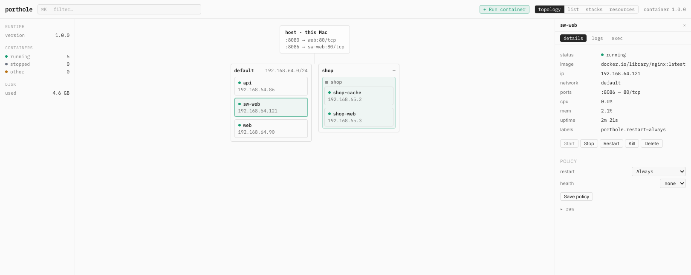
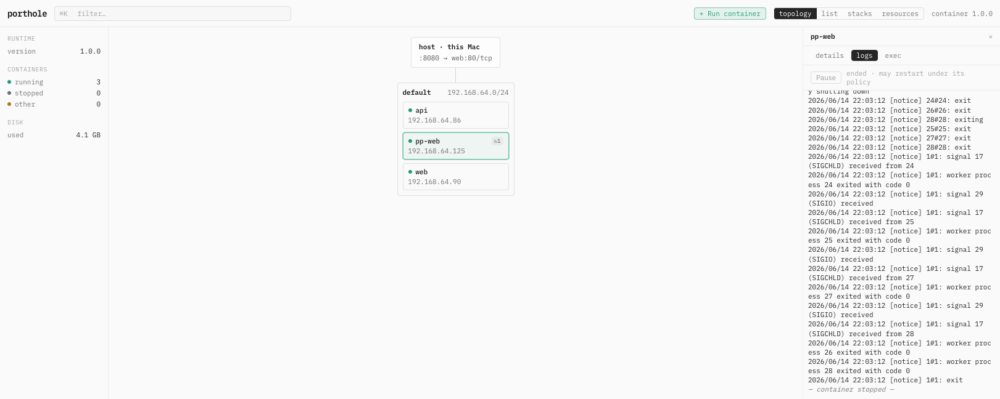

# Porthole

**A local web console for Apple's [`container`](https://github.com/apple/container) runtime — the management UI Apple didn't ship, plus the reliability and orchestration layers `container` doesn't have.**

Porthole is a single, self-contained binary that gives you a live topology of your
containers, full lifecycle control, restart policies and health checks, streaming
logs, an in-browser terminal, compose-style stacks, and one-click disk reclaim —
all from a web console that runs entirely on your Mac. It shells out to the
`container` CLI you already have and never phones home.



---

## Why

Apple's `container` is a clean, native container runtime for Apple silicon — but
it's CLI-only. There's no dashboard to see what's running, no UI to keep a
container alive across crashes, no place to watch logs or open a shell without
remembering the right flags. Porthole is that missing console. It doesn't replace
the runtime; it sits on top of the CLI and turns it into something you can *see*
and *operate*.

It also adds two things the runtime itself doesn't have: a **supervision layer**
(restart policies + health checks, so a container can be kept alive) and a
**stacks layer** (bring up a multi-container app from a compose file).

## Requirements

- **macOS 26** (Tahoe) or later
- **Apple silicon** (M1 or newer)
- **[`container`](https://github.com/apple/container) 1.0 or later** installed, with the system started:
  ```sh
  container system start
  ```

> Verified against `container` **1.0.0** (commit `ee848e3`). `container` is a young,
> fast-moving runtime; Porthole pins to the documented 1.x CLI contract and parses
> `--format json` output. If you're on a different build and something looks off,
> please open an issue with your `container --version`.

## Install

### Homebrew (recommended)

```sh
brew tap <you>/porthole
brew install porthole
brew services start porthole
```

Then open **http://127.0.0.1:9191**.

`brew services` runs Porthole as a per-user launchd agent that starts on login.
To run it by hand instead, just launch the binary:

```sh
portholed
```

### Build from source

You'll need Go 1.2x and Node 20+.

```sh
git clone https://github.com/<you>/porthole
cd porthole
make build      # builds the web UI and embeds it into a single binary
./bin/portholed
```

The result is one cgo-free `arm64` binary with the entire web console embedded —
nothing else to deploy.

## What it does

- **Create** — run a container from the UI with the full run surface: image, published
  ports, environment, volumes (including host-path binds), labels, network, resource
  limits, and command. Set a restart policy *at create* and it's supervised from birth.
- **See** — a live topology view (host → network → container) as the home screen, with
  a dense list view and a detailed inspector. Everything updates in real time over a
  server-sent-events stream.
- **Control** — start, stop, restart, kill, and delete, with optimistic UI, destructive
  confirms, and a fully typed error model (no raw CLI errors leaking to you).
- **Supervise** — restart policies (`always`, `unless-stopped`) plus HTTP/TCP health
  checks, with crash-loop backoff and a give-up ceiling. This is the reliability layer
  `container` itself lacks: stop a supervised container out of band and Porthole brings
  it back; stop it *from Porthole* and it stays down.
- **Stream logs** — per-container live logs, ring-buffered, with clean teardown when the
  container stops.
- **Exec** — a real interactive terminal in your browser (xterm.js over a host PTY),
  with resize support.
- **Orchestrate** — import a compose file (a documented subset) and bring a multi-service
  app up or down. Per-stack network isolation, supervision wired from `restart:` labels,
  topology grouping, and **non-destructive** drift detection (it shows you what changed;
  it never silently recreates).
- **Reclaim disk** — manage images, volumes, and networks with a preview-then-apply prune.
  Porthole surfaces the **anonymous-volume leak** (orphaned volumes the runtime never
  cleans up on `--rm`) that's otherwise invisible, and reclaims it in one click.



## Security

**Porthole is localhost-only by design.** This is deliberate, and it matters more than
it might look:

- It binds to `127.0.0.1` and **refuses to bind to any non-loopback address** without
  authentication.
- Every state-changing request — and the exec WebSocket upgrade — passes an Origin/Host
  allow-list that defeats DNS-rebinding and CSRF attacks from a browser, even though
  there's no login.
- It runs as **your user**, not root.
- No data ever leaves your machine.

The exec terminal is the reason this is non-negotiable: a browser-reachable interactive
shell into a container, exposed on the network without auth, would be a remote root
shell. The trust model for v0.1 is simply *"anyone who can already open a terminal on
this Mac."* That's why **remote access is a v2 feature gated on authentication**, not a
flag you can flip — see the roadmap.

## Configuration

Most people need none of this — the defaults work. But:

| What | How | Default |
|---|---|---|
| Listen address | `-addr` flag | `127.0.0.1:9191` |
| Path to the `container` CLI | `-container-bin` flag | `container` (on `PATH`) |
| Max supervised restart attempts before giving up | `PORTHOLE_MAX_RESTARTS` env | a sane built-in ceiling |
| Persistent state (policies, stacks, restart counts) | SQLite at `~/Library/Application Support/porthole/porthole.db` | created on first run |
| Version | `portholed -version` | — |

The data directory must be writable by the user the agent runs as (it is, by default,
since Porthole runs as you). Supervision policies, stack definitions, and cumulative
restart counts persist there across restarts.

## Roadmap (v2)

v0.1 is a complete single-node console. The following are deliberately deferred — most
of them are *enhancements*, and the right ones to build next are best decided by real
use, so feedback on ordering is genuinely welcome:

- **Remote access + authentication** — reach Porthole from another machine (e.g. over
  Tailscale), gated on auth because of the exec shell surface.
- **Compose service discovery** — name-based resolution between stack services. The
  runtime's embedded DNS does *not* resolve container names by default (we tested it), so
  this means injecting `/etc/hosts` entries that track IPs across restarts.
- **Destructive drift remediation** — let Stacks *apply* a recreate when a compose file
  changes, not just detect it.
- **Health-gated dependency ordering** — start stack services in dependency order, waiting
  on health.
- **`on-failure` restart policy** — currently impossible: the runtime doesn't expose a
  container's exit code, so "restart only on failure" can't be implemented faithfully.
  Tracked upstream.
- **Richer create form** — health check at create, `--init`, read-only rootfs,
  capabilities, and create-without-start.
- **Registry login** — pull private images (today a private image surfaces as
  "not found or inaccessible").
- **Selectable list rows**, and other quality-of-life touches.

## How it works

Porthole is a Go daemon (`portholed`) that wraps the `container` CLI — it shells out,
parses the JSON output, and exposes a small REST + SSE API on `127.0.0.1:9191`. The web
console (React + Vite + TypeScript + Tailwind) is compiled and embedded into the binary
at build time via `go:embed`, so the whole thing ships as one cgo-free Mach-O `arm64`
file with no runtime dependencies beyond `container` itself. Persistent state lives in a
pure-Go SQLite database; there's no external datastore.

The runtime is reached through an `Engine` interface (CLI-backed today), which keeps a
future native path additive.

## Contributing

```sh
make build                    # build UI + embed + compile
go test -race ./...           # backend tests
npm --prefix web run test     # frontend tests
npm --prefix web run build    # build the UI alone
```

Issues and pull requests welcome. If you're reporting a bug, please include your macOS
version, `container --version`, and your Apple-silicon model — a fair number of reports
come down to environment mismatches.

## License

[MIT](LICENSE).
